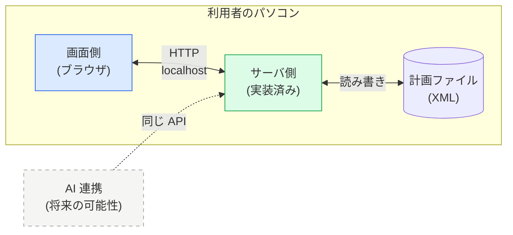

# 全体像

> 用語は [`00-glossary.md`](00-glossary.md) で定義しています。先にそちらをご覧ください。

## このツールは何をするものか

**XML 形式の計画ファイルを開き、内容を確認し、更新するためのツール**です。

利用者のパソコンの中だけで動きます。外部のサーバへ計画の内容を送ることはありません。

主にできること（詳細は [`ui/10-screens.md`](ui/10-screens.md)）:

1. 計画ファイルを開く
2. **ガントチャート**で、いつ何をやるかを時間軸で見る
3. **ネットワーク図**で、タスクのつながりとボトルネックを見る
4. 内容を更新する
5. **差分**で、どこを変えたかを確認してから保存する
6. **複数のプロジェクトを一度に見る。** 並べ方を「リソース別」にすると、
   同じリソースの作業が全プロジェクト横断で 1 本の時間軸に並ぶ（[`ui/15-multi-project.md`](ui/15-multi-project.md)）
7. **調整パネル**で、1 人に絞って案を試し、決めて、記録する（[`ui/16-adjust.md`](ui/16-adjust.md)）

> 6 と 7 が、このツールを作る動機の中心です（リソースの調整）。
> ただし**資源の取り合いを自動で判定することはしません。** 見えるようにするまでが役目です。

## 構成



- **画面側とサーバ側は同じパソコンの中**にあり、localhost 上の HTTP でやり取りします
- 今のところ**両者を分離する予定はありません**。ただし将来分離する可能性は残します
- **将来 AI から叩く可能性**があるため、画面配信の経路と API の経路を最初から分けます
  （API はすべて `/api/v1/` の下に置く）。
  AI に何をさせたいかによって必要な機能が変わるため、確認事項に挙げています（→ `Q-018`）

## 境界の定義 — 何が API を通るか

| 通るもの | 通らないもの |
|---|---|
| 計画ファイルの XML 文字列 | 画面のレイアウト・表示状態 |
| 計画の識別子（`planId`）と版（`revision`） | どのタスクを選択中か |
| 検証結果（エラー・警告の一覧） | ガント図の拡大率、スクロール位置 |
| 保存の成否 | 差分の表示形式 |

**判断の指針**: 「別の画面設計にしても同じものが必要か？」を問う。
必要ならサーバ側、そうでなければ画面側に置きます。

## この構成における重要な設計判断

### 1. 計画は XML ではなく、サーバ側が変換した JSON で受け取る 🟢 (`Q-003` ✅)

サーバ側と画面側は、計画の中身を **XML の文字列そのもの**で受け渡します。
構造化された形（JSON など）に変換して渡すことはしません。

**これによる利点**: サーバ側が XML をそのまま扱えるなら、変換処理が要らない。

**これによる課題**:

- 画面側が XML を解釈して、ガントやネットワーク図を組み立てる必要がある
- **一部だけ更新することができない**。常に全文の置き換えになる
- 全文置き換えは、**他人の変更を気づかずに消す**危険がある

3 つ目の課題への対策が、次の項目です。

### 2. 保存時に版を照合する（楽観ロック） 🔴推測 (`Q-005`)

計画を読み込むと、サーバ側は `revision`（版の印）を一緒に返します。
保存するときは、その印を `If-Match` として送り返します。

サーバ側が持っている版と食い違っていれば、保存は拒否されます（`409 Conflict`）。

```
読み込み   → revision "r1" を受け取る
（別の誰かが保存 → サーバ側は "r2" になる）
保存を試行 → If-Match: "r1" を送る → 409 で拒否される
           → 最新を取り直し、差分を見せて、やり直す
```

この仕組みは**後から足すのが大変**（画面側とサーバ側の両方の改修になる）ため、
最初から仕様に入れています。サーバ側が未対応なら、サーバ側の課題として残します。

### 3. 保存の前に必ず差分を見せる

計画ファイルは、壊すと影響が大きいものです。
そのため「保存」を押した瞬間に書き込むのではなく、
**何が変わるのかを見せてから確定する**流れにします。
詳細は [`ui/13-diff.md`](ui/13-diff.md)。

## いまの状態

**2026-09-04 にサーバ側の I/F 一覧を受領しました。** 読み込み側は実物に合わせ済みです。
保存・検証はサーバ側で**未実装**と分かったため、いまの新 GUI は**読み込み専用**（編集は画面内ドラフト）です。
受領した原文は [`interface/received/`](interface/received/) にあります。

⚠️ それ以外（保存 I/F の形、`consumed` の単位、リソースと人の関係など）は引き続き未確認です。

このドキュメント群に書かれていることは、**ほぼすべてこちら側の想定**です。
確定度マーカー（🟢🟡🔴）で区別しており、<!--legend-->
確認が必要な項目は [`90-open-questions.md`](90-open-questions.md) に集約されています。

社内環境に戻ったら、そのページの順に確認していけば合わせ込みが進みます。
