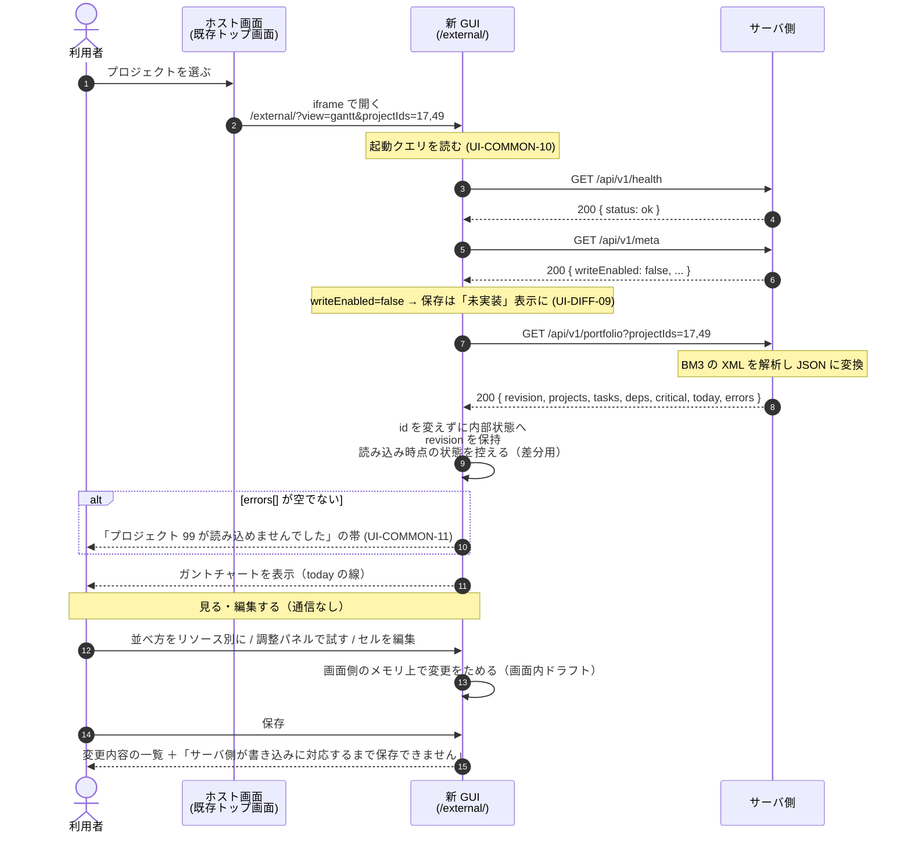
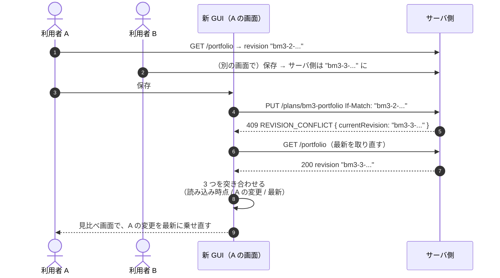
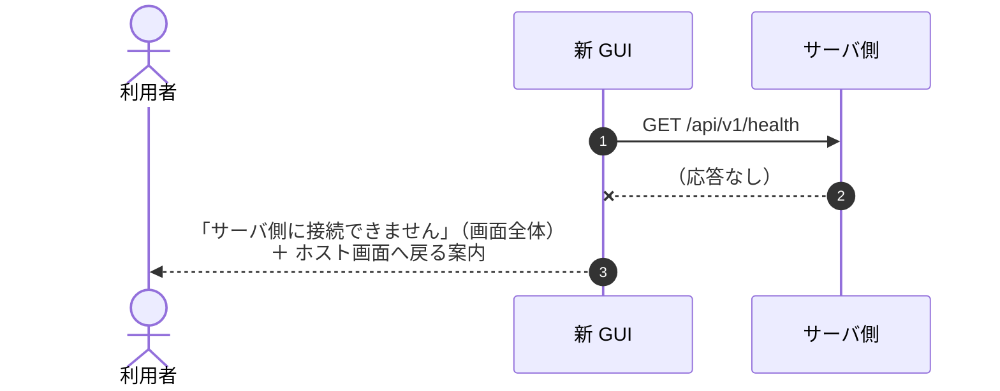
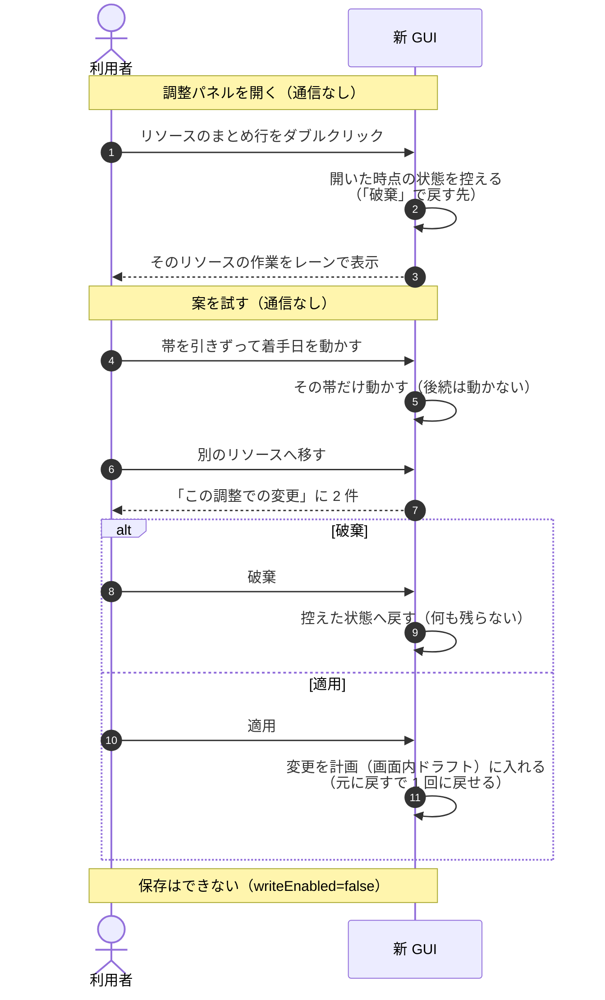

# 処理の流れ — 画面側とサーバ側のやり取りを時系列で

> 用語は [`../00-glossary.md`](../00-glossary.md) で定義しています。
> API の定義は [`openapi.yaml`](openapi.yaml)、解説は [`21-api.md`](21-api.md)。

## この章の現在の状態

**2026-09-04 にサーバ側の I/F 一覧を受領し、流れ 1 を実物に合わせました。**
保存に関わる流れ（2・3）は、保存 I/F が未実装のため**将来の流れ**として残しています。

---

## 1. 起動して、見て、編集する 🟢（保存は未実装）

### この図の要点

- **「ファイルを開く」は無い。** どのプロジェクトを見るかは、ホスト画面からクエリで渡されてくる
- **XML は画面側に来ない。** サーバ側が JSON に変換して返す
- **編集はできるが、保存はできない**（`writeEnabled=false`）。変更は画面内ドラフトで、ブラウザを閉じると消える。
  この事実を利用者に隠さない
- **`today` はサーバ側から来る。** 画面側の時計を使わない
- `revision` は使い道がまだ無いが、**保持しておく**（将来の保存 I/F で使う予定）

---

## 2. 保存が衝突する（`UI-DIFF-06`）🔴 将来の流れ

**保存 I/F が未実装のため、いまは起きません。** 実装されたときのために残しています。
`revision` が `GET /portfolio` の応答に含まれるので、この照合は実現できる見込みです（`Q-005`）。

### 3 つを突き合わせる意味

A の変更を**捨てさせない**ために、「読み込み時点」「A がいま持っているもの」「最新」の 3 つを比べます。
A が触っていない箇所は最新をそのまま採り、触った箇所だけ A の変更を乗せ直します。
両方が同じ箇所を触っていれば、利用者に選ばせます。

---

## 3. 壊れた計画を保存しようとする 🔴 将来の流れ

**保存 I/F が未実装のため、いまは起きません。**

画面側でできる検証（依存の循環）は、接続を作った瞬間に画面側で止めています（`UI-CONNECT-04`）。
サーバ側の検証（`POST /validate`）が実装されたら、保存の直前に呼ぶ位置にします。

---

## 4. サーバ側に繋がらない 🟢

### この図の要点

- 新 GUI はサーバ側から配信されているので、**画面が出ているのに API が返らない**のは
  サーバ側が途中で止まった場合に限られる。起動直後よりも、長時間開いたままのときに起きやすい
- 復帰の基本は**ホスト画面に戻ってやり直す**こと

---

## 5. 調整パネルで試して、適用する（`UI-ADJ-*`）🟢（保存は未実装）

### この図の要点

- **「適用」は画面内ドラフトへの反映であって、保存ではありません。** いまはその先が無い
- 調整パネルの中はサーバ側と通信しません
- **後続タスクは動きません。** 日程の再計算はサーバ側の役目です（→ `Q-026`）
- 調整メモは計画に入りません。残す場所は未確認です（→ `Q-037`）
