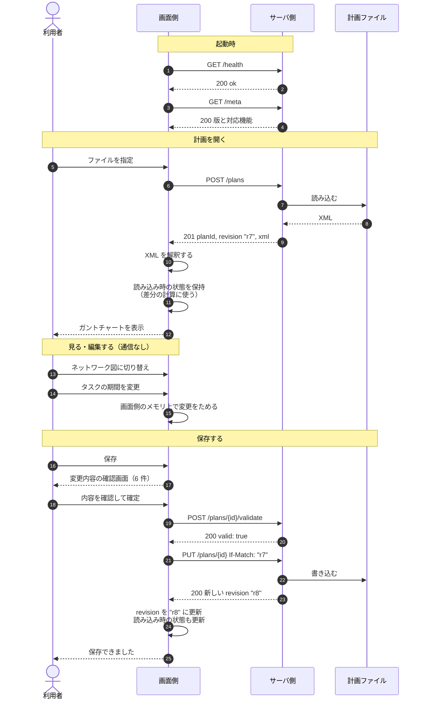
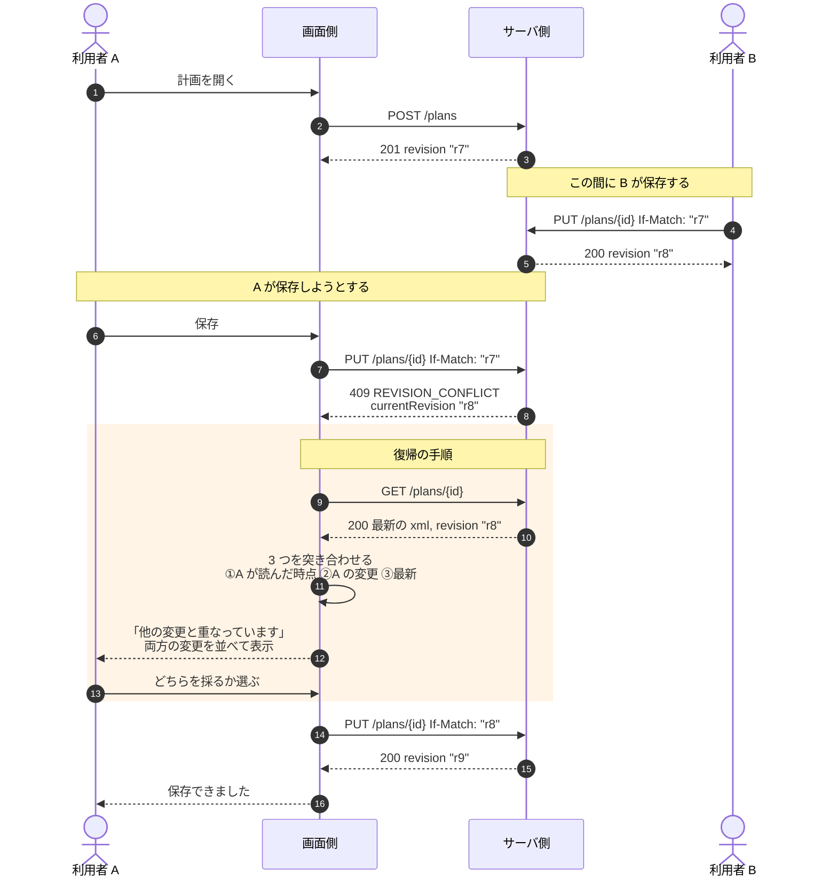
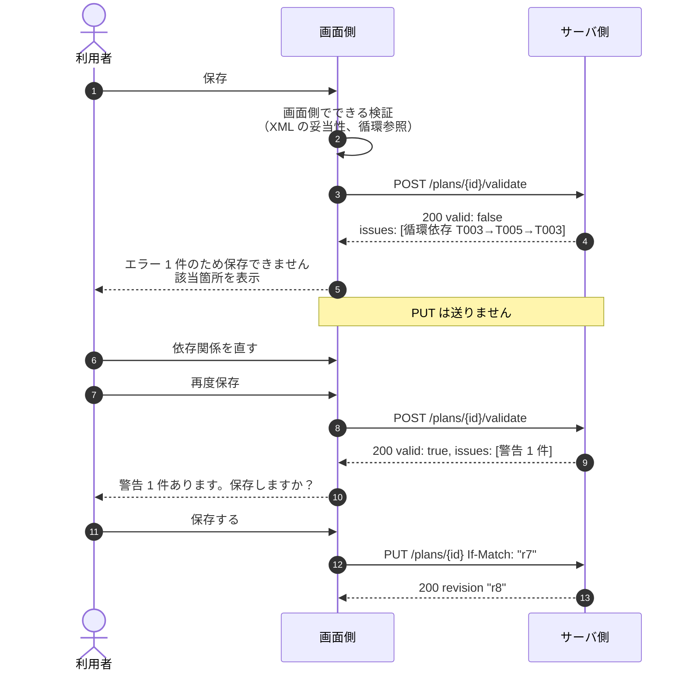
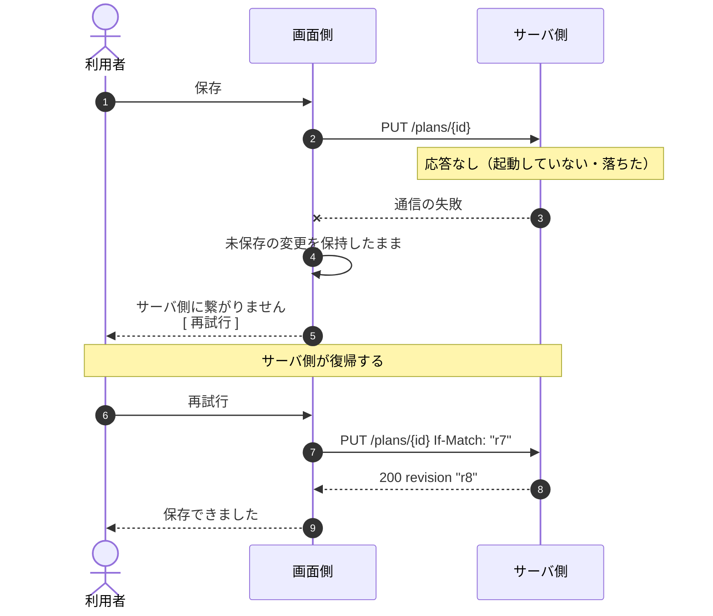
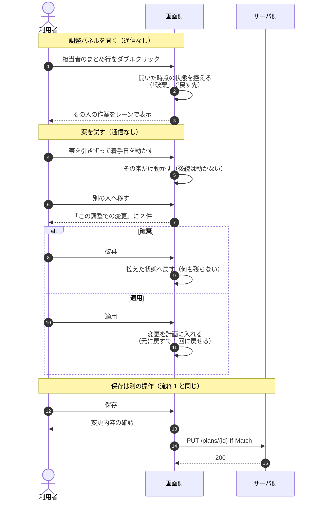

# 主要な処理の流れ

> 用語は [`../00-glossary.md`](../00-glossary.md) で定義しています。

この章は、画面側とサーバ側のやり取りを時系列で示します。
**実装するときは、この図の通りに動くかを確かめてください。**

---

## 1. 開いて、見て、保存する（正常系）



### この図の要点

- **編集中はサーバ側と通信しません。** 変更は画面側にためておき、保存時にまとめて送ります
- **`revision` は保存のたびに更新します。** 古いまま持っていると、次の保存が必ず衝突します
- **読み込み時の状態も保存後に更新します。** 更新し忘れると、
  次の差分表示に「もう保存済みの変更」が出続けます

---

## 2. 保存が衝突する（`UI-DIFF-06`）

**このツールで最も重要な流れです。** ここを誤ると、利用者の作業が失われます。



### この図の要点

> ⛔ **`409` を受け取ったとき、利用者の変更を捨ててはいけません。**

- 必ず**最新を取り直して**から突き合わせます
- 突き合わせるのは **3 つ**です。「自分の変更」と「最新」の 2 つでは、
  **どちらが変更した箇所なのかが分かりません**
- 再試行するときの `If-Match` は、**取り直した新しい版**（`"r8"`）です。
  古い `"r7"` のままだと、また `409` になります

### 3 つを突き合わせる意味

```
①読み込み時   基本設計 12d,  実装 20d
②自分の変更   基本設計 15d,  実装 20d    ← 基本設計だけ変えた
③最新         基本設計 12d,  実装 25d    ← 他人は実装だけ変えた

→ 触れている箇所が重なっていない
→ 両方を活かせる: 基本設計 15d, 実装 25d
```

重なっていなければ**自動で両立できます。**
重なっている場合だけ、利用者に選ばせます。

⚠️ サーバ側が `revision` に対応していない場合、この流れは成立しません（→ `Q-005`）。

---

## 3. 壊れた XML を保存しようとする



### この図の要点

- **エラーがあれば `PUT` を送りません。** 送っても拒否されるだけで、
  やり取りが無駄になります
- **警告は保存を止めません。** 利用者に判断を委ねます
- 検証の結果に問題があっても、**HTTP は `200`** です。
  「検証できたこと」自体は成功だからです
  （[`22-errors.md`](22-errors.md) 参照）

---

## 4. サーバ側に繋がらない



### この図の要点

> ⛔ **通信が失敗しても、未保存の変更は絶対に捨てないでください。**

サーバ側が復帰すれば、そのまま保存できます。
ここで変更を失うと、利用者の作業がすべて無駄になります。

⚠️ サーバ側の起動方法が未確認のため、利用者への案内文は未確定です（→ `Q-002`）。


---

## 5. 調整パネルで試して、適用して、保存する（`UI-ADJ-*`）



### この図の要点

- **「適用」は計画への反映であって、保存ではありません。** 保存は流れ 1 の通り、
  変更内容を見せてから `PUT` で送ります。段階が 2 つあることを利用者に隠しません
- **調整パネルの中はサーバ側と通信しません。** 試すたびに通信すると、
  「やっぱり無し」が重くなります
- **後続タスクは動きません。** 日程の再計算はサーバ側の役目です（→ `Q-026`）。
  再計算をサーバ側に頼めるようになったら、「適用」の直後に頼むのが自然な位置です
- 調整メモは計画ファイルに入りません。残す場所は未確認です（→ `Q-037`）
