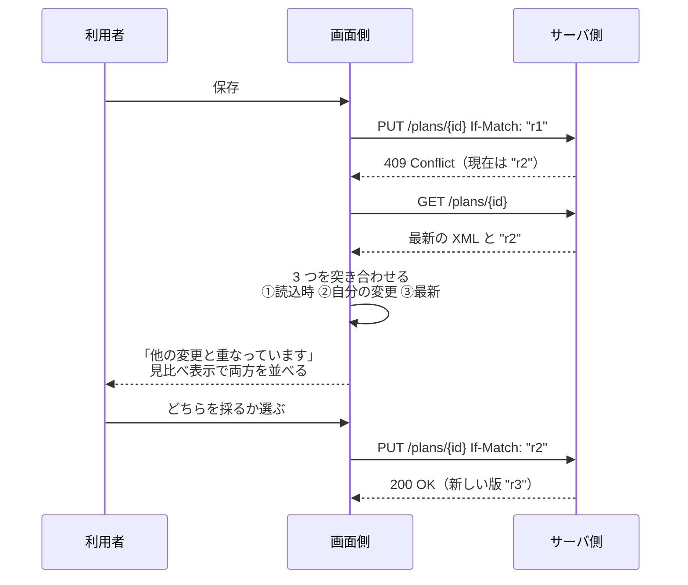

# 変更内容の見せ方

> 用語は [`../00-glossary.md`](../00-glossary.md) で定義しています。
> 操作 ID の索引は [`10-screens.md`](10-screens.md) にあります。

## いまの状態 — 保存はできません 🟢

**2026-09-04 に受領したサーバ側の I/F で、保存・検証は未実装と分かりました。**
`GET /meta` の `writeEnabled` が `false` の間、画面側はサーバ側へ保存しません。

### `UI-DIFF-09` 保存を「未実装（画面内ドラフト）」の表示に留める 🟢

| 場所 | 表示 |
|---|---|
| 画面上部の「保存」ボタン | 「保存（未実装）」。押すと変更内容の一覧が開く（関所としての役目はそのまま） |
| 変更内容の一覧の「検証」「保存」 | 押せない。理由を添える |
| 一覧の下 | 「サーバ側が書き込みに対応するまで保存できません。変更は画面内ドラフトとして残り、ブラウザを閉じると消えます」 |

**編集そのものは今まで通りできます。** サーバ側の文書も「画面内ドラフト」を認めています。
`writeEnabled` が `true` を返すようになったら、この表示を外して `UI-DIFF-03` を有効にします。

この章の他の部分（`UI-DIFF-01`〜`08`）は差分の計算と見せ方であり、画面側だけで完結するので有効です。
`UI-DIFF-02` `UI-DIFF-03` `UI-DIFF-06` は保存 I/F が実装されたときのために残しています。

## この章の役割

計画ファイルは、壊すと影響が大きいものです。
「保存」を押した瞬間に書き込むのではなく、
**何がどう変わるのかを見せて、納得してから確定する**流れにします。

## 独立した画面にはしない

以前は「変更内容」を別のタブにしていました。**これをやめます。**

理由は、**変更を確認したい相手が「ガントの帯」や「ネットワーク図の線」だから**です。
別画面に一覧を並べても、「基本設計の期間が 3 日延びた」が
**日程のどこに効くのか**は分かりません。図の上で見て初めて分かります。

そこで、**ガントチャートとネットワーク図の上に直接重ねます。**
変更の一覧は、画面下の折りたたみパネルに置きます（情報は失いません）。

---

## 3 つの状態 🔴推測 (`Q-031`)

ガントチャートとネットワーク図の両方に、同じ切り替えを置きます。

| 状態 | 見え方 | 使う場面 |
|---|---|---|
| **オフ** | 通常表示 | 普段の編集中 |
| **濃淡** | 変更したものはそのまま、**変更のないものを薄く**する | 「自分がどこを触ったか」を確かめる |
| **見比べ** | 画面を左右に割り、**左＝読み込み時点 / 右＝いま** | 「どう変わったか」を確かめる |

### `UI-DIFF-07` 濃淡で示す

変更した行・セル・帯・ノード・接続はそのまま。**それ以外を薄くします。**

- 表では、変更した**セル**に下線を引き、行の左端に印を付ける
- 変更のない行は文字を淡くする
- ガントでは、変更のない帯とマイルストンを薄くする
- ネットワーク図では、変更のないノードと線を薄くする

**画面の構成は変わりません。** 編集を続けながら、いつでも状態を確かめられます。

### `UI-DIFF-08` 左右で見比べる

チャートの領域を 2 つに割り、**左に読み込み時点、右にいま**を描きます。

- **行の並びは左右で揃えます。** 揃っていないと見比べになりません
- **時間軸の目盛りも左右で共通**にします。
  左右で縮尺が違うと、帯の長さの比較が意味を失います
- 左（読み込み時点）には**編集の手がかりを出しません**（接続ハンドルなど）。
  過去は編集できないため
- 濃淡も同時にかけます

ネットワーク図も同じく左右に並べます。

> **今回の作り込みでの割り切り**: 削除された行は左側に表示されません。
> 行の並びを左右で揃える都合上、いま存在しない行の置き場所がないためです。
> 削除は**変更の一覧**に出ます。実装時に見直す余地があります。

---

## 「薄くする」の作り方 🟡暫定

**半透明の白を前面に貼る方法は採りません。**

一見よさそうですが、**明るいテーマでしか成立しません。**
暗いテーマだと白い膜のほうが明るく、
**「薄くしたつもりのものが画面で一番目立つ」**という逆転が起きます。

代わりに**不透明度を下げます。** 地の色が透けるため、
明るいテーマでも暗いテーマでも「引っ込む」方向に働きます。
あわせて彩度も落とし、色の主張を弱めます。

> 見た目の狙いは同じで、**テーマに依存しない形にした**ということです。

### 変更したセルの強調に「塗り」を使わない

表の中で変更したセルを塗って示すと、
**バッファ行など、もともと色が付いている行と見分けがつかなくなります。**

そのため、下線と行頭の印で示します。塗りは使いません。

---

## 変更の一覧 `UI-DIFF-01` 🔴推測 (`Q-013`)

画面下の折りたたみパネルに置きます。

**「XML の何行目が変わったか」ではなく、「計画として何が変わったか」を見せます。**
利用者が知りたいのは「`<duration>` が `12` から `15` になった」ではなく、
「基本設計の期間が 3 日延びた」だからです。

| 種類 | 表示 |
|---|---|
| 追加 | 追加されたタスクと主要項目 |
| 削除 | 削除されたタスク名 |
| 変更 | 変わった項目のみ、変更前 → 変更後 |
| 接続 | どのタスク間のつながりが増減したか |

**未保存の変更があることは、常に画面上部に出します。**
折りたたまれていても、変更があることは分かるようにします。

**差分は画面側で計算します**（読み込み時点の状態を保持しておけば実現でき、
サーバ側に依存しないため）。

---

## 検証 `UI-DIFF-02` 🔴推測 (`Q-014`)

保存する前に、計画として妥当かを確かめます。

**確かめたいこと**: XML として壊れていないか / 想定する形式に沿っているか /
依存関係が循環していないか / 参照先のないタスクを指していないか / 日付の矛盾

結果は**エラーと警告に分けます。**

- **エラー** — 保存できない。直すまで先へ進めない
- **警告** — 保存できる。利用者の判断に委ねる

> なお**循環する接続は、繋ごうとした時点で断ります**（`UI-CONNECT-04`）。
> 検証まで待たせるより親切です。

⚠️ サーバ側に検証の仕組みがあるかは未確認です（→ `Q-014`）。

---

## 保存 `UI-DIFF-03` 🔴推測 (`Q-015`)

1. 検証する。エラーがあれば止める
2. 変更を反映した XML を組み立てる
3. `PUT /api/v1/plans/{planId}` に、`If-Match` で読み込み時の `revision` を添えて送る
4. 成功したら新しい `revision` を受け取って保持する
5. 失敗が `409` なら `UI-DIFF-06` へ

**保存を押したら、まず変更内容を見せます。** そこを通らずには保存できません。

---

## `UI-DIFF-06` 保存が衝突したときに復帰する 🔴推測 (`Q-005`)

**自分が読み込んだ後に、誰か（または自分の別ウィンドウ）が保存していた場合**、
サーバ側は `409 Conflict` を返します。

このとき、**変更を捨てさせてはいけません。**

**ここで `UI-DIFF-08`（左右で見比べる）がそのまま使えます。**
衝突の解決も「変更前と変更後を見比べる」作業だからです。
専用の画面を作る必要はありません。

⚠️ この機能はサーバ側が `revision` に対応していることが前提です（→ `Q-005`）。

---

## この章が必要とする API

| 操作 | 必要な API |
|---|---|
| `UI-DIFF-02` 検証 | `POST /api/v1/plans/{planId}/validate` |
| `UI-DIFF-03` 保存 | `PUT /api/v1/plans/{planId}`（`If-Match` 付き） |
| `UI-DIFF-06` 復帰 | `GET /api/v1/plans/{planId}` |
| `UI-DIFF-01` `07` `08` 差分の表示 | なし（画面側で計算） |
