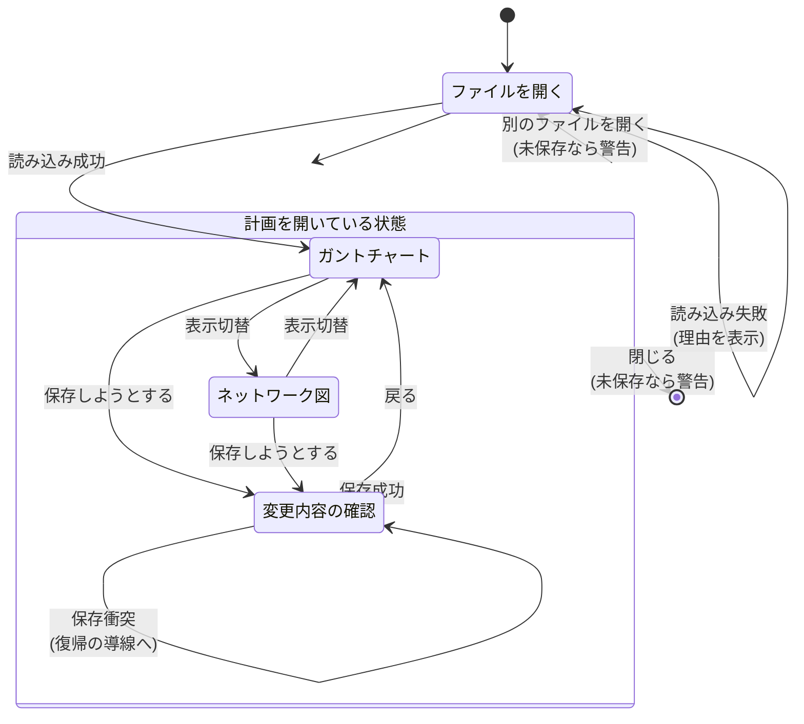

# 画面遷移

> 用語は [`../00-glossary.md`](../00-glossary.md) で定義しています。

## 全体の流れ



## 画面の関係

**ガントチャートとネットワーク図は対等**です。どちらが主ということはありません。
同じ計画を別の角度から見たもので、常に相互に行き来できます。

**変更内容の確認画面は、保存への通り道**です。
保存はここを通らなければできません（[`13-diff.md`](13-diff.md) 参照）。

## 状態の引き継ぎ

### `UI-COMMON-04` 選択中のタスクを画面間で引き継ぐ 🔴推測

ガントチャートで選んだタスクは、ネットワーク図へ切り替えても選択されたままです。
逆も同じです。

ネットワーク図では、選択されたノードが見える位置まで自動で移動します
（画面外にあると、選択されていることが分からないため）。

### 保持するもの・しないもの

| 保持する | 保持しない |
|---|---|
| 選択中のタスク | ガントの拡大率（画面ごとに独立） |
| 未保存の変更 | ネットワーク図の表示位置 |
| 読み込み時の `revision` | スクロール位置 |
| 読み込み時の計画（差分の計算に使う） | |

## `UI-COMMON-02` 未保存の変更があるときの警告 🔴推測

未保存の変更がある状態で、次の操作をしようとしたら警告します。

- 別の計画ファイルを開こうとした
- ブラウザのタブを閉じようとした
- ブラウザの戻るボタンを押した

**警告の選択肢**: 「保存する」「保存せずに続ける」「やめる」の 3 つを出します。

「保存する」を選んだ場合は変更内容の確認画面へ移り、
**そこで保存を完了させてから**元の操作を続けます。

⚠️ ブラウザのタブを閉じる操作については、
**ブラウザの制約により、独自の文言や選択肢を出すことはできません。**
ブラウザ標準の確認ダイアログが出るだけです。この点は実装時の制約として認識しておきます。

## `UI-COMMON-01` 画面の切り替え方 🔴推測

画面上部にタブを置きます。

```
┌─────────────────────────────────────────────────┐
│  project-a.xml                        [ 保存 ]  │
│  ┌──────────┬──────────────┬──────────────┐    │
│  │ ガント    │ ネットワーク図 │ 変更 (6)      │    │
│  └──────────┴──────────────┴──────────────┘    │
```

**「変更」タブには未保存の変更件数を表示します。**
変更があることを常に見えるようにし、保存し忘れを防ぐためです。
変更が 0 件のときは数字を出しません。
